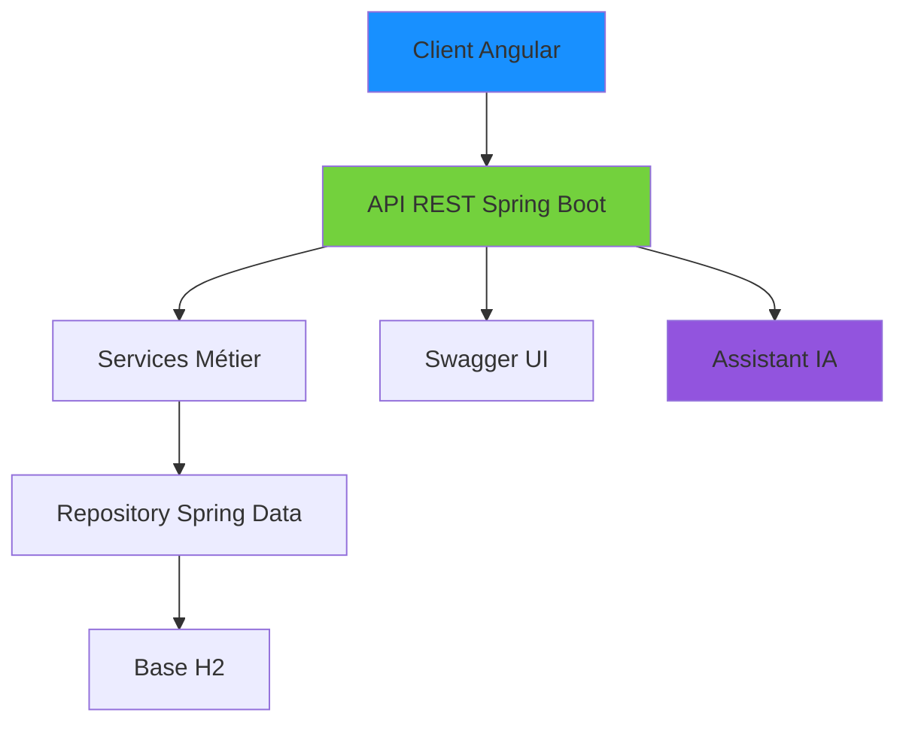
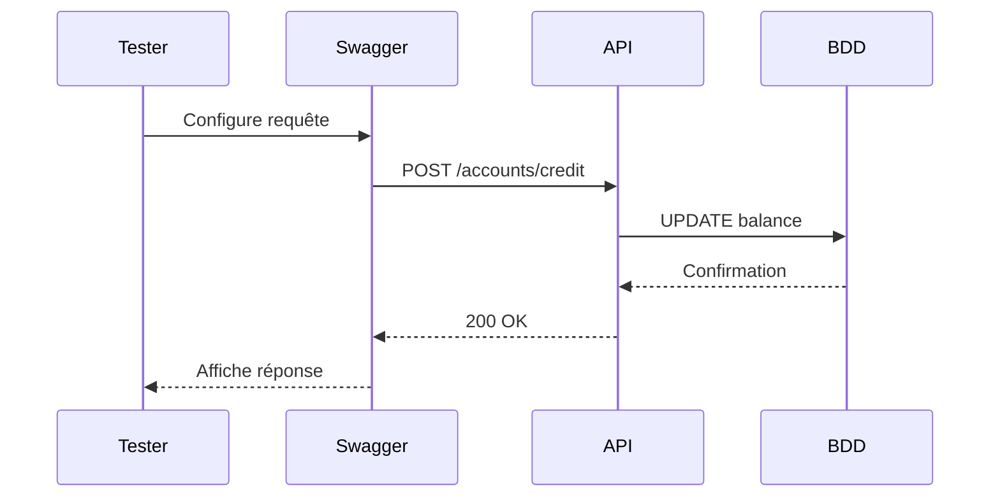
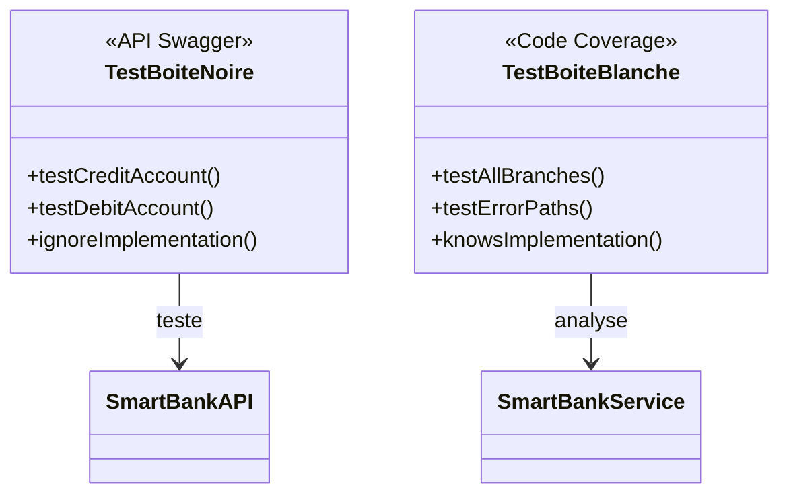
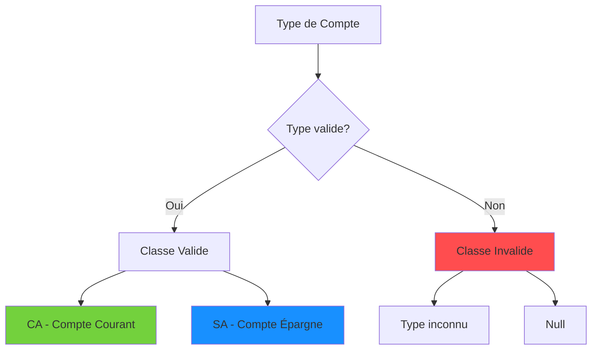
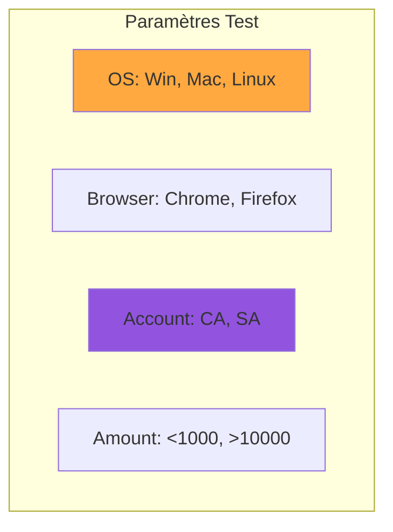
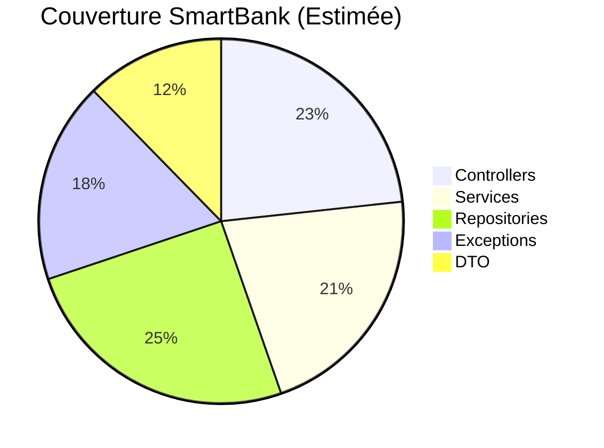
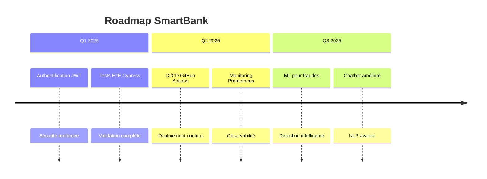

# Génie Logiciel - Rapport de Projet SmartBank

**Prof :** Mohamed Yousfi 
**Date :** 2A Cycle Ingénieur - Semestre 1 - 2025/2026

---

## Table des Matières

1. [Introduction](#introduction)
2. [Partie 1: Architecture du Projet SmartBank](#partie-1-architecture)
3. [Partie 2: Implémentation et Tests](#partie-2-implementation)
4. [Partie 3: Techniques de Test Avancées](#partie-3-techniques-avancees)
5. [Conclusion](#conclusion)
6. [Annexes](#annexes)

---

## Introduction

Ce document présente une synthèse complète du projet SmartBank, une application bancaire digitale développée dans le cadre du cours de Génie Logiciel. Le projet illustre l'ensemble des concepts étudiés : architecture logicielle, tests, et bonnes pratiques d'ingénierie.

Le projet SmartBank est une application full-stack avec :
- **Backend** : API REST Spring Boot
- **Frontend** : Application Angular
- **Base de données** : H2 en mémoire
- **Fonctionnalités IA** : Assistant chatbot intelligent

---

## Partie 1: Architecture du Projet SmartBank

### 1.1 Vue d'ensemble du Système

L'application SmartBank permet la gestion complète des comptes bancaires, avec une interface admin pour la gestion des clients et des transactions.

.png)

### 1.2 Couches d'Architecture

Le projet suit une architecture en couches respectant les principes de séparation des responsabilités :



### 1.3 Spécifications des API

L'application expose plusieurs endpoints documentés via Swagger UI :

.png)

**Endpoints principaux :**
- `POST /api/accounts/credit` - Créditer un compte
- `POST /api/accounts/debit` - Débiter un compte
- `POST /api/accounts/transfer` - Transfert entre comptes
- `GET /api/admin/users` - Gestion des clients
- `POST /api/ai/chat` - Interaction avec l'IA

### 1.4 Structure de la Base de Données

La base H2 contient les tables suivantes :

.png)

```sql
SELECT * FROM BANK_ACCOUNT;
```

Résultat :
- **Type de compte** : CA (Compte Courant) / SA (Compte Épargne)
- **Taux d'intérêt** : 5.5% pour les comptes épargne
- **Découvert autorisé** : 9000 MAD pour les comptes courants

---

## Partie 2: Implémentation et Tests

### 2.1 Conventions de Codage

> **Concept Clé :** Les conventions de codage sont des règles normatives qui définissent comment le code doit être écrit pour assurer sa lisibilité et sa maintenabilité.

**Bonnes pratiques appliquées dans SmartBank :**

| Élément | Convention | Exemple |
|---------|------------|---------|
| **Nommage des classes** | CamelCase | `BankAccountRestController` |
| **Nommage des méthodes** | camelCase explicite | `getFlaggedCells()` |
| **Nommage des variables** | Significatif | `accountBalance` |
| **Commentaires** | Javadoc pour API | Voir exemple ci-dessous |

#### Exemple de code documenté :

```java
/**
 * Calcule l'âge moyen d'une liste de personnes.
 * 
 * @param personnes Liste des personnes à traiter
 * @return Âge moyen calculé
 * @throws IllegalArgumentException si la liste est null ou vide
 * @since 1.0.0
 */
public double calculerAgeMoyen(List<Personne> personnes) {
    if (personnes == null || personnes.isEmpty()) {
        throw new IllegalArgumentException("La liste ne peut pas être vide");
    }
    // Implémentation...
}
```

### 2.2 Tests d'Intégration avec Swagger

> **Astuce :** Utilisez Swagger UI pour tester vos API directement sans frontend.

.png)

**Processus de test :**
1. **Arrange** : Préparer les données (ID de compte, montant)
2. **Act** : Exécuter la requête POST /credit
3. **Assert** : Vérifier le code 200 OK et le solde mis à jour



### 2.3 Inspection des Données

> **Exemple :** Vérification directe dans la base H2 après opérations.

.png)

**Requête SQL pour audit :**
```sql
SELECT * FROM ACCOUNT_OPERATION 
WHERE BANK_ACCOUNT_ID = '245ele63-9189-4fa2-a695-87459c997fe1';
```

---

## Partie 3: Techniques de Test Avancées

### 3.1 Test Boîte Noire vs Boîte Blanche



**Application sur SmartBank :**
- **Boîte Noire** : Tester via Swagger sans regarder le code
- **Boîte Blanche** : Utiliser JaCoCo pour mesurer la couverture

### 3.2 Tests de Partition d'Équivalence

> **Concept Clé :** Diviser le domaine d'entrée en classes où le comportement est supposé identique.

**Exemple avec les types de comptes :**



**Cas de test effectifs :**
- **CA** : Vérifier frais de tenue de compte
- **SA** : Vérifier calcul des intérêts 5.5%

### 3.3 Test par Paires (Pairwise Testing)

> **Astuce :** La plupart des erreurs sont causées par l'interaction de 2 paramètres.

**Configuration système SmartBank :**

| OS | Navigateur | Type Compte | Montant |
|----|------------|-------------|---------|
| Win | Chrome | CA | 500 MAD |
| Mac | Firefox | SA | 10000 MAD |
| Linux | Edge | CA | 50000 MAD |



### 3.4 Analyse des Valeurs Limites

**Règles métiers SmartBank :**
- Découvert max : 9000 MAD
- Minimum opération : 10 MAD

**Valeurs limites à tester :**
- **Min-** : 8999.99 (doit échouer)
- **Min** : 9000.00 (doit réussir)
- **Max+** : 10 (doit réussir)
- **Max++** : 9.99 (doit échouer)

### 3.5 Couverture de Code

> **Exemple :** Utilisation de JaCoCo pour mesurer la couverture.



**Objectif :** Atteindre 80% de couverture sur les branches critiques.

---

## Conclusion

### 5.1 Points Clés à Retenir

> **Triangle de la Qualité Software :**
> - **Code** : Lisible avec conventions strictes
> - **Tests** : Automatisés via Swagger et JUnit
> - **Documentation** : Swagger + Javadoc complète

### 5.2 Checklist de Révision pour l'Examen

- [✓] Maîtriser les API REST avec Spring Boot
- [✓] Savoir tester avec Swagger UI
- [✓] Comprendre les métriques de couverture
- [✓] Appliquer les conventions de nommage
- [✓] Documenter avec Javadoc

### 5.3 Perspectives d'Évolution



---

## Annexes

### Annexe A: Glossaire des Termes

| Terme | Définition | Exemple SmartBank |
|-------|------------|-------------------|
| **Driver** | Simule un module appelant | TestRestTemplate |
| **Stub** | Remplace un module appelé | Mock Repository |
| **Oracle** | Source de vérité | Base H2 de référence |
| **CI** | Intégration Continue | GitHub Actions |

### Annexe B: Modèle de Cas de Test

```java
@Test
public void testCredit_ValidAccount_ShouldIncreaseBalance() {
    // Arrange
    String accountId = "245ele63-9189-4fa2-a695-87459c997fe1";
    double initialBalance = 19683.61;
    double creditAmount = 500.0;
    
    // Act
    Account result = accountService.credit(accountId, creditAmount);
    
    // Assert
    assertEquals(initialBalance + creditAmount, result.getBalance(), 0.01);
}
```


### Annexe D: Ressources

- **Repository GitHub** : `[Abdelhamid M. LOUKI](https://github.com/MAHAMAT-AHMAT/projet-final-gestion-comptes-bancaires-ai.git)`
- **Repository GitHub** : `dirdaymi/Smart-bank`
- **Repository GitHub** : `https://github.com/zakaria-bouzouba/digital-banking-app.git`
- **Repository GitHub** : `https://github.com/anouarMohamed`


