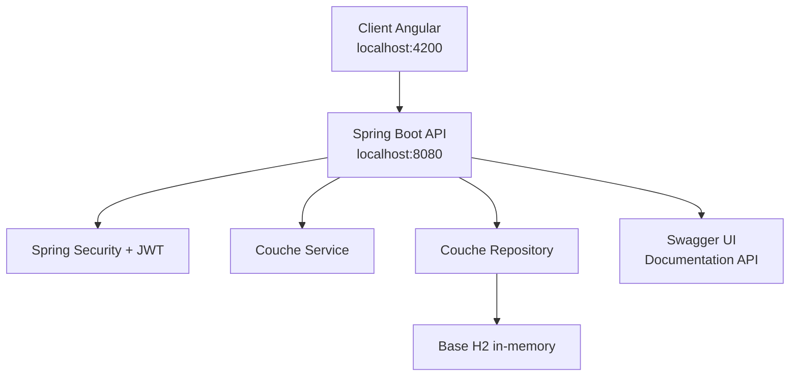
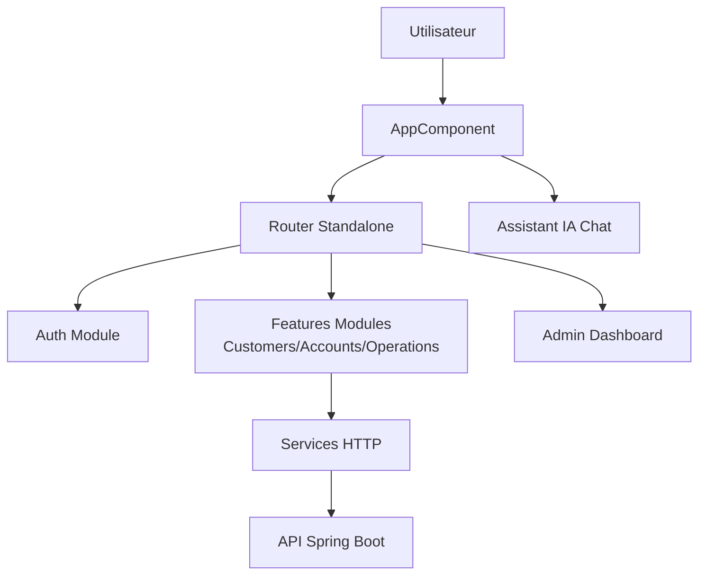

# Rapport Détaillé : Projet Smart Bank - Application Bancaire Full Stack

**Auteur** : Abdel-hamid MAHAMAT LOUKI

---

## 📊 Vue d'ensemble du projet

Smart Bank est une application bancaire complète full-stack avec :
- **Backend** : Spring Boot (Java) avec base de données H2
- **Frontend** : Angular 17 (standalone components)
- **Fonctionnalités** : Gestion clients/comptes, opérations bancaires, tableau de bord admin, assistant IA

---

## 🏗️ Architecture Technique

### Backend - Spring Boot

### Frontend - Angular 17

---

## 📸 Analyse Détaillée des Captures

### 1. Tableau de Bord Admin - Gestion des Comptes
.png)

---

### 2. Problème de Sérialisation JSON - Erreur Critique
.png)

---

### 3. Test API Réussi - Crédit de Compte
.png)

---

### 4. Assistant IA Multicanal - Bot Telegram
.png)

---

### 5. Base de Données H2 - Structure des Comptes
.png)

---

### 6. Table des Opérations Vide - Problème de Persist
.png)

---

### 7. Données Actualisées dans H2
.png)

---

### 8. Documentation API - Swagger UI
.png)

---

### 9. Test Endpoint Accounts
.png)

---

